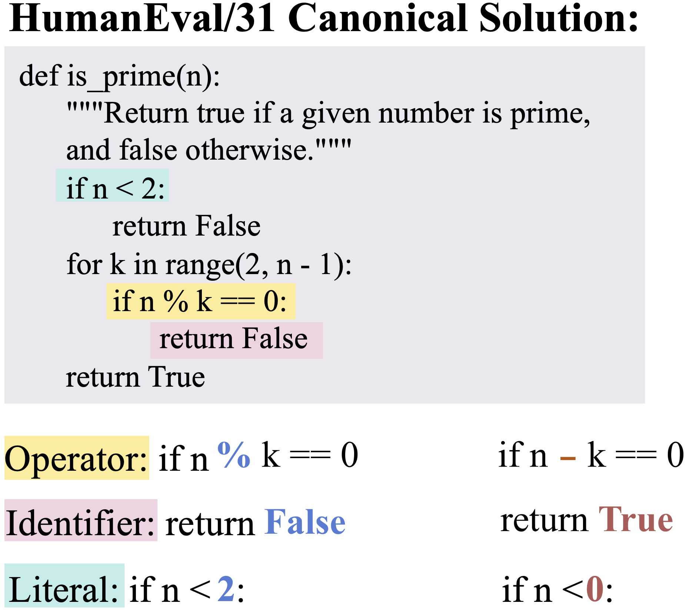
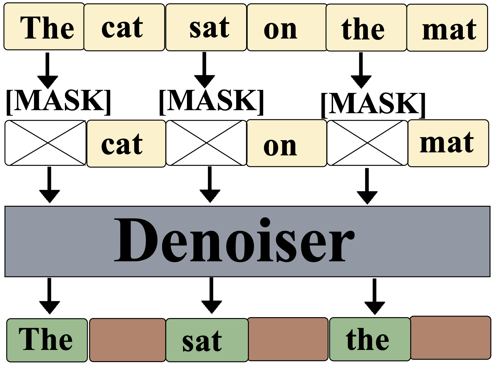

<div align="center">

# CDLM: Corrective Diffusion Language Models

**A research framework for studying and improving self-correction in masked diffusion language models**

[](https://arxiv.org/abs/XXXX.XXXXX)
[](https://github.com/zhangshuibai/CDLM)

</div>

**Authors**: [Shuibai Zhang](https://zhangshuibai.github.io/)<sup>1</sup>, [Fred Zhangzhi Peng](https://pengzhangzhi.github.io/home/)<sup>2</sup>, [Yiheng Zhang](https://yiheng0824.github.io/)<sup>1</sup>, [Jin Pan](https://jhinpan.github.io/)<sup>1</sup>, [Grigorios G Chrysos](https://grigoris.ece.wisc.edu/about.html)<sup>1</sup>

<sup>1</sup>University of Wisconsin–Madison &nbsp;&nbsp; <sup>2</sup>Duke University

<p align="center">
  <table>
    <tr>
      <td align="center">
        
        <br>
        <em>(a) CRB corruption pipeline. A canonical program is tokenized, corrupted via type-preserving token replacement, validated by execution, categorized, and generated as a benchmark instance.</em>
      </td>
      <td align="center">
        
        <br>
        <em>(b) MDLM training. Cross-marked boxes denote masked tokens, while beige tokens are visible inputs. Green outputs indicate masked positions where the reconstruction loss is applied, whereas brown outputs correspond to unmasked tokens that receive no supervision during training.</em>
      </td>
    </tr>
  </table>
</p>

---

## Abstract

Diffusion language models are structurally well-suited for iterative error correction, as their non-causal denoising dynamics allow arbitrary positions in a sequence to be revised. However, standard masked diffusion language model (MDLM) training fails to induce such behavior, since incorrect but visible tokens receive no supervision, leaving token-level confidence uninformative about reliability. As a result, confidence-guided refinement is ineffective for targeted correction.

To address this mismatch, we study corrective behavior in diffusion language models and propose a **correction-oriented training principle** that explicitly supervises visible incorrect tokens, enabling MDLMs to acquire error-aware confidence and targeted refinement capabilities. To systematically evaluate corrective behavior, we introduce the **Code Revision Benchmark (CRB)**, a controllable and executable benchmark designed to evaluate corrective behavior in diffusion language models.

This repository provides the implementation and evaluation framework for our corrective diffusion language models, supporting controlled code corruption and iterative refinement for systematic evaluation of how well masked diffusion language models can localize and correct errors through self-revision mechanisms.

## Features

- 🔄 **Iterative self-revision** with diffusion language models
- 🎯 **Controlled token-level corruption** (operator, identifier, literal substitutions)
- 📊 **Confidence–correctness analysis** in remasking decisions
- 🎓 **Corrective training** with supervision on corrupted-but-visible tokens
- 📈 **Controlled corruption** support for HumanEval, HumanEval+, MBPP, and MBPP+

## Quick Start

### Installation

```bash
# Clone the repository
git clone https://github.com/zhangshuibai/CDLM.git
cd CDLM
```

**Note**: This repository supports multiple diffusion language models. Please refer to the respective model repositories for installation instructions:

- **LLaDA models**: Follow the installation guide at [ML-GSAI/LLaDA](https://github.com/ML-GSAI/LLaDA)
- **Dream models**: Follow the installation guide at [DreamLM/Dream](https://github.com/DreamLM/Dream.git)
- **Open-dLLM models**: Follow the installation guide at [pengzhangzhi/Open-dLLM](https://github.com/pengzhangzhi/Open-dLLM.git)

Additionally, install the core dependencies required by this repository:

```bash
pip install torch transformers datasets evaluate autopep8 tqdm
```

### Usage

The example scripts run a complete pipeline: **code generation → corruption with controlled errors → iterative refinement → evaluation**.

```bash
# For LLaDA model
bash examples/test_human-eval_llada.sh

# For Dream model
bash examples/test_human-eval_dream.sh

# For Open-dLLM model
bash examples/test_human-eval_open-dllm.sh
```

### Key Parameters

You can modify the following parameters in the example scripts:

- **`MODEL_NAME`**: HuggingFace model identifier (e.g., `GSAI-ML/LLaDA-8B-Base`)
- **`DATASET`**: Evaluation dataset (`human-eval`, `human-eval+`, `mbpp`,`mbpp+`)
- **`ERROR_TYPE`**: Type of corruption to inject
  - `operator`: Arithmetic/logical operator substitution
  - `var`: Identifier substitution (variable/function names)
  - `literal`: Constant value substitution
- **`N_REPLACE`**: Number of tokens to corrupt per sample (default: `1`)
- **`DATA_NUM`**: Number of corrupted variants to generate per correct sample (default: `5`)
- **`REFINED_STEPS`**: Number of denoising steps for refinement (starts from `2`; can use `2`, `3`, `4`, `5`, etc.)
- **`TEMPERATURE`**: Sampling temperature for refinement (default: `0.0` for greedy decoding)
- **`ALGORITHM`**: Refinement algorithm (`self_conf-remask:vanilla` for confidence-based remasking)
- **`CONFIDENCE_THRESHOLD`**: Confidence threshold for remasking decisions (default: `0.90`)

## Controlled Code Corruption (`codecorrection/generate.py`)

The `generate.py` script injects controlled token-level errors into correct code samples, creating a benchmark for evaluating model correction capabilities.

### ⚠️ Important: Tokenizer Dependency

**Different models use different tokenizers**, which tokenize the same code into different token sequences. For example:
- The operator `>=` may be tokenized as 1 token in some tokenizers, but 2 tokens in others
- Variable names and numeric literals may also be tokenized into different numbers of tokens

**Therefore, you must use the same tokenizer as the model you will use for evaluation/refinement** when generating error code. This ensures that:
- Token positions remain consistent throughout the pipeline
- Error injection aligns with the model's tokenization scheme
- Refinement can accurately target corrupted tokens

### Pipeline Overview

```
Load Dataset/File → Extract Correct Code → Tokenize → Inject Errors (Token-level) → 
Verify Consistency → Generate Multiple Variants → Save as JSONL
```

### Error Types

The script supports three types of controlled corruption:

1. **`operator`**: Arithmetic/logical operator substitution
   - Supported operators: `+`, `-`, `*`, `/`, `<`, `>`, `>=`, `<=`, `!=`, `==`, `>>`, `<<`
   - Operators are grouped by token count to ensure consistent replacement

2. **`var`**: Identifier substitution (variable/function names)
   - Excludes Python keywords
   - Only replaces identifiers with the same token count

3. **`literal`**: Numeric literal substitution
   - Replaces numeric constants (integers and floats)
   - Maintains token count consistency

### Key Mechanisms

#### Token-Level Replacement
- All replacements maintain **token count consistency** (e.g., replacing a 2-token variable with another 2-token variable)
- This ensures the token sequence length remains unchanged, facilitating downstream processing

#### Token Consistency Verification
- `check_token_consistency()`: Verifies that encoding → decoding → re-encoding produces the same token sequence
- Prevents token position shifts that could occur due to tokenizer behavior
- Failed consistency checks result in discarding the corrupted sample

#### Comment Handling
- Automatically detects and skips operators/variables/literals within comments
- Uses Python's `tokenize` module to identify comment ranges
- Ensures errors are only injected into executable code

#### Multi-Variant Generation
- The `data_num` parameter controls how many corrupted variants are generated per correct sample
- Each variant uses different random replacements
- Useful for robust evaluation and statistical analysis

#### Deduplication
- The `--deduplicate` flag removes duplicate items based on `buggy_body` content
- Prevents generating identical corrupted code variants

### Usage Example

```bash
# Generate operator errors using LLaDA tokenizer
python codecorrection/generate.py \
    --dataset human-eval \
    --error_type operator \
    --n_replace 1 \
    --data_num 5 \
    --model_name GSAI-ML/LLaDA-8B-Base \
    --data_path buggy_datasets

# Generate from existing evaluation results
python codecorrection/generate.py \
    --dataset human-eval \
    --error_type var \
    --n_replace 1 \
    --data_num 10 \
    --model_name GSAI-ML/LLaDA-8B-Base \
    --input_file evaluated_results.jsonl \
    --deduplicate
```

### Important Notes

- ⚠️ **Critical**: The `--model_name` parameter must match the model you will use for subsequent evaluation/refinement
- Different tokenizers will produce different corrupted code, even for the same original code
- If there are insufficient replaceable elements in the code, the script may fail to generate the specified number of error variants
- Certain tasks are automatically excluded (e.g., HumanEval/32, MBPP/342) due to structural issues

## Project Structure

```
CDLM/
├── codecorrection/      # Code correction and noise injection utilities
│   └── generate.py      # Controlled corruption generation
├── examples/            # Example scripts for running experiments
│   ├── test_human-eval_llada.sh
│   ├── test_human-eval_dream.sh
│   └── test_human-eval_open-dllm.sh
├── figures/             # Paper figures and diagrams
│   └── CRB_pipeline.pdf
├── evaluate_code.py     # Code evaluation script
├── llada_sample.py      # Core sampling and remasking logic
├── refine_code.py       # Code refinement pipeline
├── sanitize.py          # Code sanitization utilities
└── utils.py             # Utility functions
```

## Citation

If you find this work useful, please cite:

```bibtex
@article{zhang2024corrective,
  title={Corrective Diffusion Language Models},
  author={Zhang, Shuibai and Peng, Fred Zhangzhi and Zhang, Yiheng and Pan, Jin and Chrysos, Grigorios G},
  journal={arXiv preprint arXiv:XXXX.XXXXX},
  year={2024}
}
```

## License

[Add your license here]

## Contact

For questions and issues, please open an issue on GitHub or contact:

**Shuibai Zhang** <shuibai@cs.wisc.edu>
