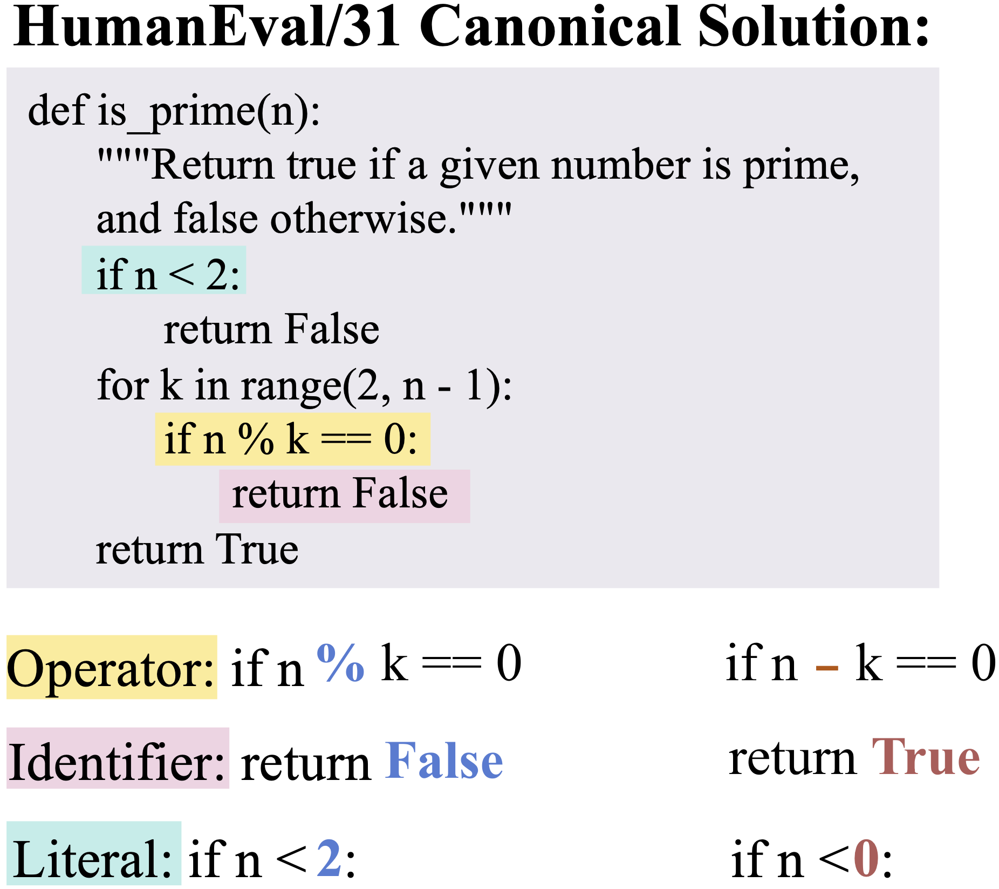
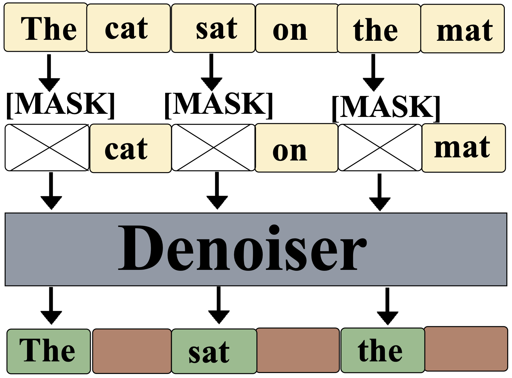

<div align="center">

# CDLM: Corrective Diffusion Language Models

**A research framework for studying and improving self-correction in masked diffusion language models**

[](https://zhangshuibai.github.io/CDLM/)
[](https://arxiv.org/pdf/2512.15596)
[](https://huggingface.co/collections/Shuibai12138/cdlm)

</div>

**Authors**: [Shuibai Zhang](https://zhangshuibai.github.io/)<sup>1</sup>, [Fred Zhangzhi Peng](https://pengzhangzhi.github.io/home/)<sup>2</sup>, [Yiheng Zhang](https://yiheng0824.github.io/)<sup>1</sup>, [Jin Pan](https://jhinpan.github.io/)<sup>1</sup>, [Grigorios G Chrysos](https://grigoris.ece.wisc.edu/about.html)<sup>1</sup>

<sup>1</sup>University of Wisconsin–Madison &nbsp;&nbsp; <sup>2</sup>Duke University

<p align="center">
  <table>
    <tr>
      <td align="center">
        
        <br>
        <em>(a) CRB corruption pipeline. A canonical program is tokenized, corrupted via type-preserving token replacement, validated by execution, categorized, and generated as a benchmark instance.</em>
      </td>
      <td align="center">
        
        <br>
        <em>(b) MDLM training. Cross-marked boxes denote masked tokens, while beige tokens are visible inputs. Green outputs indicate masked positions where the reconstruction loss is applied, whereas brown outputs correspond to unmasked tokens that receive no supervision during training.</em>
      </td>
    </tr>
  </table>
</p>

---

## Abstract

Diffusion language models are structurally well-suited for iterative error correction, as their non-causal denoising dynamics allow arbitrary positions in a sequence to be revised. However, standard masked diffusion language model (MDLM) training fails to induce such behavior, since incorrect but visible tokens receive no supervision, leaving token-level confidence uninformative about reliability. As a result, confidence-guided refinement is ineffective for targeted correction.

To address this mismatch, we study corrective behavior in diffusion language models and propose a **correction-oriented training principle** that explicitly supervises visible incorrect tokens, enabling MDLMs to acquire error-aware confidence and targeted refinement capabilities. To systematically evaluate corrective behavior, we introduce the **Code Revision Benchmark (CRB)**, a controllable and executable benchmark designed to evaluate corrective behavior in diffusion language models.

This repository provides the implementation and evaluation framework for our corrective diffusion language models, supporting controlled code corruption and iterative refinement for systematic evaluation of how well masked diffusion language models can localize and correct errors through self-revision mechanisms.

## Features

- 🔄 **Iterative self-revision** with diffusion language models
- 🎯 **Controlled token-level corruption** (operator, identifier, literal substitutions)
- 📊 **Confidence–correctness analysis** in remasking decisions
- 🎓 **Corrective training** with supervision on corrupted-but-visible tokens (see [training/README.md](training/README.md))
- 📈 **Controlled corruption** support for HumanEval, HumanEval+, MBPP, and MBPP+

## Quick Start

### Installation

```bash
# Clone the repository
git clone https://github.com/zhangshuibai/CDLM.git
cd CDLM
```

Evaluation and training use separate environments:

- **Evaluation**, which covers CRB refinement and scoring, code generation and the example scripts
  below: Python 3.11 with the pins of
  [evaluation/requirements.txt](evaluation/requirements.txt). Install steps and notes are in
  [evaluation/ENVIRONMENT.md](evaluation/ENVIRONMENT.md):

  ```bash
  conda create -n cdlm-eval python=3.11.13 -y && conda activate cdlm-eval
  pip install torch==2.5.0 --index-url https://download.pytorch.org/whl/cu121
  pip install https://github.com/Dao-AILab/flash-attention/releases/download/v2.7.4.post1/flash_attn-2.7.4.post1+cu12torch2.5cxx11abiFALSE-cp311-cp311-linux_x86_64.whl
  pip install -r evaluation/requirements.txt
  pip check
  ```

- **Training**: see [training/README.md](training/README.md#environment). It uses a different torch
  build and a different transformers version.

The evaluation environment was verified with the Open-dCoder models. LLaDA and Dream models are
loaded with `trust_remote_code`; their requirements are in
[ML-GSAI/LLaDA](https://github.com/ML-GSAI/LLaDA) and [DreamLM/Dream](https://github.com/DreamLM/Dream.git).

Open-dCoder models are loaded with the `veomni` package from the bundled `Open-dLLM/` directory. The
launchers in `evaluation/` set `PYTHONPATH` themselves. To run the top-level scripts directly, set it
from the repository root:

```bash
export PYTHONPATH="$PWD/Open-dLLM"
python -c "import veomni; print(veomni.__file__)"   # should print <repo>/Open-dLLM/veomni/__init__.py
```

Do not `pip install` `Open-dLLM/`. Do not put `training/` on `PYTHONPATH` here either: its `veomni`
is the training copy (see [training/README.md](training/README.md#environment)).

### Usage

To reproduce the paper's evaluations, see [Evaluation](#evaluation). The example scripts run a
complete pipeline for one setting: **code generation → corruption with controlled errors →
iterative refinement → evaluation**.

```bash
# For LLaDA model
bash examples/test_human-eval_llada.sh

# For Dream model
bash examples/test_human-eval_dream.sh

# For Open-dLLM model
bash examples/test_human-eval_open-dllm.sh
```

### Key Parameters

You can modify the following parameters in the example scripts:

- **`MODEL_NAME`**: HuggingFace model identifier (e.g., `GSAI-ML/LLaDA-8B-Base`)
- **`DATASET`**: Evaluation dataset (`human-eval`, `human-eval+`, `mbpp`,`mbpp+`)
- **`ERROR_TYPE`**: Type of corruption to inject
  - `operator`: Arithmetic/logical operator substitution
  - `var`: Identifier substitution (variable/function names)
  - `literal`: Constant value substitution
- **`N_REPLACE`**: Number of tokens to corrupt per sample (default: `1`)
- **`DATA_NUM`**: Number of corrupted variants to generate per correct sample (default: `5`)
- **`REFINED_STEPS`**: Number of denoising steps for refinement (starts from `2`; can use `2`, `3`, `4`, `5`, etc.)
- **`TEMPERATURE`**: Sampling temperature for refinement (default: `0.0` for greedy decoding)
- **`ALGORITHM`**: Refinement algorithm (`self_conf-remask:vanilla` for confidence-based remasking)
- **`CONFIDENCE_THRESHOLD`**: Confidence threshold for remasking decisions (default: `0.90`)

## Released models and data

| | Hugging Face | Revision | `model.safetensors` sha256 |
| --- | --- | --- | --- |
| Open-dCoder-0.5B (base, from Open-dLLM) | [`fredzzp/open-dcoder-0.5B`](https://huggingface.co/fredzzp/open-dcoder-0.5B) | `d0d86d5b99960c05258bb1f8265dd91564dbac67` | `59c1a005f4b672bdd3bbdab6258b283dff3b87bab5cc4bbc0d479e8388f77b6e` |
| MDLM-0.5B (paper) | [`Shuibai12138/Open-Dcoder-0.5B-baseline-mdm-step2000`](https://huggingface.co/Shuibai12138/Open-Dcoder-0.5B-baseline-mdm-step2000) | `fa5eef962d343a0d813d1f963a5d44c39deaed45` | `4f1f412cdac13553b76fd8de569ae9ed5a95447dfabaaf16da508d09344ff36e` |
| CDLM-0.5B (paper) | [`Shuibai12138/Open-Dcoder-0.5B-mixture-mdm-step2000`](https://huggingface.co/Shuibai12138/Open-Dcoder-0.5B-mixture-mdm-step2000) | `5a7170e7c2333e41d5312c690ac4818722a76c3a` | `e43f9fa6b4cccfc18a2bac8925d64f5a020fa6a6d34db2c801220e22fdf8a680` |
| MDLM-OCI (reference, **not a paper model**) | [`Shuibai12138/Open-Dcoder-0.5B-MDLM-OpenCodeInstruct`](https://huggingface.co/Shuibai12138/Open-Dcoder-0.5B-MDLM-OpenCodeInstruct) | `535b36930a32109c87986c341bf554cc42e76b2e` | `31521c7d9f5c02fd2d6b4769ae8d99490c4261af0bc5b566d42d0076221067c4` |
| CDLM-OCI (reference, **not a paper model**) | [`Shuibai12138/Open-Dcoder-0.5B-CDLM-OpenCodeInstruct`](https://huggingface.co/Shuibai12138/Open-Dcoder-0.5B-CDLM-OpenCodeInstruct) | `8eb87fe2ab6850ced7606c8a678c84f1b28fd170` | `3ae362eb296006bcd139234967bcc5503296b7912261fda337b867d44713acd4` |
| CRB inputs (dataset) | [`Shuibai12138/crb-paper-inputs`](https://huggingface.co/datasets/Shuibai12138/crb-paper-inputs) | `21cae17423b073b152e997746876d6b828b18358` | — |

- **Paper models.** They are listed under the ids that the CRB launcher accepts, which must contain
  `open-dcoder`. [`Shuibai12138/CDLM-0.5B`](https://huggingface.co/Shuibai12138/CDLM-0.5B)
  (`b142acd9ed0546d699cf95e2c84e3e1fdfc11b10`) has the same weights as CDLM-0.5B. The earlier
  revisions used by the paper's evaluation runs ([evaluation/README.md](evaluation/README.md#models))
  hold the same weights; later commits changed only the model card.
- **OCI reference models.** They were trained on the public
  [`nvidia/OpenCodeInstruct`](https://huggingface.co/datasets/nvidia/OpenCodeInstruct)
  (`8f3ba5bafe4d6e8db46082cf7ae6741bc370604d`), not on the paper's data, with
  `ARM=cdlm|mdlm bash training/scripts/train_0.5b_opencodeinstruct.sh` at commit `5e52812`. No paper
  number comes from them. CRB Pass@1 at `n_replace = 1` (macro over 12 cells, threshold 0.9) after
  T = 1 and T = 4 refinement steps: CDLM-OCI 0.2196 and 0.3070, MDLM-OCI 0.1401 and 0.2387. See
  [training/README.md](training/README.md#opencodeinstruct-variant).
- The ablation checkpoints and the CRB instances are listed in
  [training/README.md](training/README.md#released-checkpoints).

## Evaluation

[evaluation/README.md](evaluation/README.md) describes the two evaluations of the paper's 0.5B
models. Each one is a single script, run from the repository root:

```bash
# CRB error localisation and correction (CDLM-0.5B in Tables 3, 4 and 7); add --nr 1 for the headline cells only
bash evaluation/crb/run_crb.sh Shuibai12138/Open-Dcoder-0.5B-mixture-mdm-step2000 cdlm --gpus 0 \
    --model_revision 5a7170e7c2333e41d5312c690ac4818722a76c3a

# from-scratch code generation on HumanEval(+) and MBPP(+) (Table 5 top, Table 9)
bash evaluation/codegen/run_codegen_eval.sh \
    Shuibai12138/Open-Dcoder-0.5B-mixture-mdm-step2000@5a7170e7c2333e41d5312c690ac4818722a76c3a outputs/codegen/cdlm 0
```

- Both scripts accept a Hub id or a local checkpoint. They check their code, inputs and model
  before running, and write a JSON summary.
- For CDLM-0.5B, on an A100, the repository code reproduced the paper's runs bit for bit:
  - the CRB refined programs at `n_replace = 1`;
  - the HumanEval samples with vanilla decoding.
- [evaluation/README.md](evaluation/README.md) lists exactly what was checked, the runtimes, and why
  CRB needs a model name that contains `open-dcoder`. `Shuibai12138/CDLM-0.5B` has the same weights
  as `Shuibai12138/Open-Dcoder-0.5B-mixture-mdm-step2000`, but CRB needs the second name.
- Both evaluations execute model-generated code. Run them in an isolated environment.

## Controlled Code Corruption (`codecorrection/generate.py`)

The `generate.py` script injects controlled token-level errors into correct code samples, creating a benchmark for evaluating model correction capabilities.

### ⚠️ Important: Tokenizer Dependency

**Different models use different tokenizers**, which tokenize the same code into different token sequences. For example:
- The operator `>=` may be tokenized as 1 token in some tokenizers, but 2 tokens in others
- Variable names and numeric literals may also be tokenized into different numbers of tokens

**Therefore, you must use the same tokenizer as the model you will use for evaluation/refinement** when generating error code. This ensures that:
- Token positions remain consistent throughout the pipeline
- Error injection aligns with the model's tokenization scheme
- Refinement can accurately target corrupted tokens

### Pipeline Overview

```
Load Dataset/File → Extract Correct Code → Tokenize → Inject Errors (Token-level) → 
Verify Consistency → Generate Multiple Variants → Save as JSONL
```

### Error Types

The script supports three types of controlled corruption:

1. **`operator`**: Arithmetic/logical operator substitution
   - Supported operators: `+`, `-`, `*`, `/`, `<`, `>`, `>=`, `<=`, `!=`, `==`, `>>`, `<<`
   - Operators are grouped by token count to ensure consistent replacement

2. **`var`**: Identifier substitution (variable/function names)
   - Excludes Python keywords
   - Only replaces identifiers with the same token count

3. **`literal`**: Numeric literal substitution
   - Replaces numeric constants (integers and floats)
   - Maintains token count consistency

### Key Mechanisms

#### Token-Level Replacement
- All replacements maintain **token count consistency** (e.g., replacing a 2-token variable with another 2-token variable)
- This ensures the token sequence length remains unchanged, facilitating downstream processing

#### Token Consistency Verification
- `check_token_consistency()`: Verifies that encoding → decoding → re-encoding produces the same token sequence
- Prevents token position shifts that could occur due to tokenizer behavior
- Failed consistency checks result in discarding the corrupted sample

#### Comment Handling
- Automatically detects and skips operators/variables/literals within comments
- Uses Python's `tokenize` module to identify comment ranges
- Ensures errors are only injected into executable code

#### Multi-Variant Generation
- The `data_num` parameter controls how many corrupted variants are generated per correct sample
- Each variant uses different random replacements
- Useful for robust evaluation and statistical analysis

#### Deduplication
- The `--deduplicate` flag removes duplicate items based on `buggy_body` content
- Prevents generating identical corrupted code variants

### Usage Example

```bash
# Generate operator errors using LLaDA tokenizer
python codecorrection/generate.py \
    --dataset human-eval \
    --error_type operator \
    --n_replace 1 \
    --data_num 5 \
    --model_name GSAI-ML/LLaDA-8B-Base \
    --data_path buggy_datasets

# Generate from existing evaluation results
python codecorrection/generate.py \
    --dataset human-eval \
    --error_type var \
    --n_replace 1 \
    --data_num 10 \
    --model_name GSAI-ML/LLaDA-8B-Base \
    --input_file evaluated_results.jsonl \
    --deduplicate
```

### Important Notes

- ⚠️ **Critical**: The `--model_name` parameter must match the model you will use for subsequent evaluation/refinement
- Different tokenizers will produce different corrupted code, even for the same original code
- If there are insufficient replaceable elements in the code, the script may fail to generate the specified number of error variants
- Certain tasks are automatically excluded (e.g., HumanEval/32, MBPP/342) due to structural issues

## Corrective Training

CDLM keeps the standard masked-diffusion corruption and adds one step. After masking, each remaining
visible token is replaced, with probability `mixture_prob` (α), by a uniformly sampled wrong token.
The loss is the cross-entropy of the original token at masked and replaced positions, plus an extra
term on replaced positions weighted by `noise_token_wt` (exact form in
[training/README.md](training/README.md#objective-as-implemented)). Clean visible tokens have no loss
term (`clean_token_wt` = 0). The CDLM-0.5B checkpoint continues training `fredzzp/open-dcoder-0.5B` on
Nemotron-SFT-Code for 2000 steps with α = 0.1 and `noise_token_wt` = 0.1. The MDLM baseline uses the
same setup with α = 0 and `noise_token_wt` = 0.

**The 0.5B trainer's gradient is not the gradient of this loss.** With `reduction="none"`, the
backward of liger-kernel 0.5.8's fused linear cross-entropy scales every position's gradient by the
weight of the micro-batch's first target position. The per-token weights are therefore not
applied, some micro-batches get zero gradient, and clean visible tokens can receive gradient through
the noise term. All released 0.5B checkpoints were trained this way, and the logged losses are
correct; see [training/README.md](training/README.md#effective-gradient). The LLaDA-8B LoRA and
Sudoku trainers use torch cross-entropy and are not affected.

```bash
# first request access to nvidia/Nemotron-Pretraining-SFT-v1 on the Hub and wait for NVIDIA's approval
huggingface-cli login
python training/data_prep/prepare_nemotron_sft_code.py --paper_order   # about 59 GB; records the paper's shard order
ARM=cdlm bash training/scripts/train_0.5b.sh                           # 4 GPUs; ARM=mdlm for the baseline
```

`--paper_order` writes `data/train_path_paper_order.txt`, and the launcher then streams the shards in
the order of the paper's runs (it prints a `Shard order:` line; `PAPER_ORDER=0` opts out). Without
that file, the shards are read in the filesystem's listing order, which in general is not the
paper's.

The Nemotron dataset is gated with manual approval by NVIDIA. It is needed only to retrain the
paper's checkpoints; evaluation does not use it. `training/scripts/train_0.5b_opencodeinstruct.sh`
trains on the ungated OpenCodeInstruct instead. That is not the paper's data, and its results are not
the paper's results. The two reference models trained this way are listed under
[Released models and data](#released-models-and-data); see also
[training/README.md](training/README.md#opencodeinstruct-variant).

- [training/README.md](training/README.md): the exact objective (and how it differs from Eq. (1) as
  printed), environment, data, a map from every script to the paper experiment it reproduces,
  provenance of the released checkpoints, checkpoint conversion and evaluation.
- [training/llada8b_lora/README.md](training/llada8b_lora/README.md): LoRA transfer to LLaDA-8B-Base
  (added in the camera-ready version, NeurIPS 2026).
- [sudoku/README.md](sudoku/README.md): the from-scratch Sudoku comparison (Appendix F).

## Project Structure

```
CDLM/
├── codecorrection/      # Code correction and noise injection utilities
│   └── generate.py      # Controlled corruption generation
├── examples/            # Example scripts for running experiments
│   ├── test_human-eval_llada.sh
│   ├── test_human-eval_dream.sh
│   └── test_human-eval_open-dllm.sh
├── figures/             # Figures used in this README
│   ├── CRB_pipeline.png
│   └── mdlm_train.png
├── Open-dLLM/           # Bundled Open-dLLM (Apache-2.0); provides veomni for Open-dCoder evaluation
├── project_page/        # Project web page
├── training/            # Corrective training (CDLM / MDLM)
│   ├── scripts/         # Launchers for the 0.5B experiments
│   ├── tools/           # Checkpoint conversion to HuggingFace format
│   ├── data_prep/       # Training-data download and verification
│   ├── llada8b_lora/    # LLaDA-8B-Base LoRA transfer
│   ├── tasks/           # Training entry point (train_torch.py)
│   ├── configs/         # Training config and the resolved configs of the released runs
│   └── veomni/          # Training framework (VeOmni / Open-dLLM, Apache-2.0)
├── sudoku/              # From-scratch Sudoku experiment (Appendix F)
├── evaluate_code.py     # Code evaluation script
├── llada_sample.py      # Core sampling and remasking logic
├── refine_code.py       # Code refinement pipeline
├── sanitize.py          # Code sanitization utilities
├── utils.py             # Utility functions
└── LICENSE              # MIT
```

## Citation

If you find this work useful, please cite:

```bibtex
@inproceedings{zhang2026corrective,
      title={Corrective Diffusion Language Models},
      author={Shuibai Zhang and Fred Zhangzhi Peng and Yiheng Zhang and Jin Pan and Grigorios G. Chrysos},
      booktitle={Advances in Neural Information Processing Systems},
      year={2026},
      url={https://arxiv.org/abs/2512.15596},
}
```

## License

This project is licensed under the MIT License - see the [LICENSE](LICENSE) file for details.
`Open-dLLM/` and the framework code under `training/` (see [training/NOTICE](training/NOTICE)) are
under the Apache License 2.0. `sudoku/puzzle_generator.py` and `sudoku/advanced_sudoku_generator.py`
are third-party code by Ali Alp (MIT, per the upstream README); see
[sudoku/THIRD_PARTY_NOTICES.md](sudoku/THIRD_PARTY_NOTICES.md).

## Contact

For questions and issues, please open an issue on GitHub or contact:

**Shuibai Zhang** <shuibai@cs.wisc.edu>
